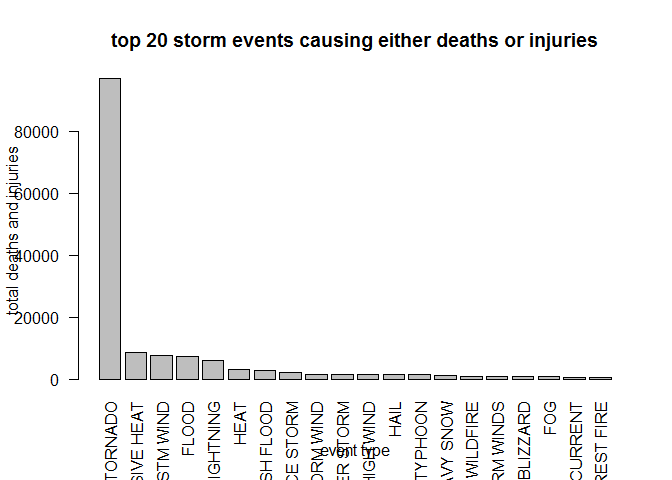
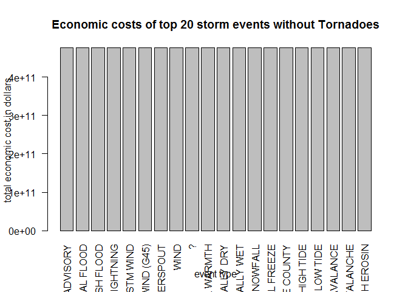
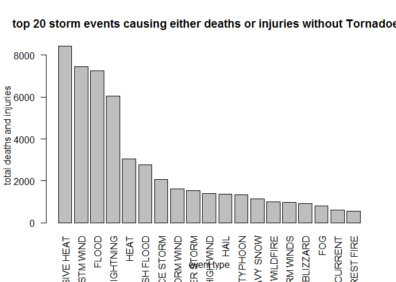

# Economic and health impact of storm events in USA


# Synopsis
While tornadoes were found to have overwhelmingly the largest impact on health and economy, it's strongly advised not to make conclusions based on the results around tornadoes (owing to the fact that NOA only tracked tornadoes for many years). Results were reported both including and excluding tornadoes. From an economic perspective, hail and flash floods caused the second and third highest economic impact respectively. Excessive heat and strong winds caused the second and third highest impact on health, respectively.

Null values were omitted to avoid incorrectly extrapolating missing values. Tornadoes were deemed an outlier and removed from the final analysis, instead of eliminating data from those years. 

# Data processing

## Loading and preprocessing the data
1. download and read the CSV, convert numeric fields to number datatypes
2. calculate the impact to human health by adding deaths to injuries. This means deaths and injuies have equal weighting in our analysis.


```r
require(data.table)
require(dplyr)

setwd("C:/Users/Yasneen/rCoursera/reproducibleResearch/project 2")
url <- "https://d396qusza40orc.cloudfront.net/repdata%2Fdata%2FStormData.csv.bz2"
f <- file.path(getwd(), "stormData.csv.bz2")
download.file(url, f)
sd <- data.table(read.csv(f))

sd$fatalities <- as.numeric(sd$FATALITIES)
sd$INJURIES<-as.numeric(sd$INJURIES)
sd$DeathPlusInjury<-sd$fatalities + sd$INJURIES

sd1<-group_by(sd,EVTYPE)
```

## Across the United States, which types of events (as indicated in the EVTYPE variable) are most harmful with respect to population health?
In our analysis, let's assume fatalities and injuries are equally weighted as indicators of harm to population health. Thus the sum of injuries + fatalities will indicate harmfulness to population health.


```r
require(data.table)
```

```
## Loading required package: data.table
```

```r
require(dplyr)
```

```
## Loading required package: dplyr
```

```
## -------------------------------------------------------------------------
```

```
## data.table + dplyr code now lives in dtplyr.
## Please library(dtplyr)!
```

```
## -------------------------------------------------------------------------
```

```
## 
## Attaching package: 'dplyr'
```

```
## The following objects are masked from 'package:data.table':
## 
##     between, last
```

```
## The following objects are masked from 'package:stats':
## 
##     filter, lag
```

```
## The following objects are masked from 'package:base':
## 
##     intersect, setdiff, setequal, union
```

```r
sdDI<-summarize(sd1,sum(DeathPlusInjury,na.rm=TRUE))
colnames(sdDI)<-c("EVTYPE","DeathPlusInjury")
```

We will remove events with zero values since they did not cause any deaths or injuries.

```r
sdDI$DeathPlusInjury <- ifelse(sdDI$DeathPlusInjury < 1, NA,sdDI$DeathPlusInjury)
sdDI<-na.omit(sdDI)
```

We will sort the data by numbers of deaths plus injuries and consider only the top 20.

```r
sdDI<-sdDI[order(sdDI$DeathPlusInjury,decreasing=TRUE),]
sdDIdisplay<-sdDI[1:20,]

barplot(sdDIdisplay$DeathPlusInjury,names=sdDIdisplay$EVTYPE,xlab="event type",ylab="total deaths and injuries",main="top 20 storm events causing either deaths or injuries",las=2)
```

<!-- -->

We see that tornadoes cause far more harm to population health than all the other event types. However this may be an outlier, since NOA only tracked tornadoes for many years. Analyze the remaining data.


```r
sdDIdisplay$DeathPlusInjury<-ifelse(sdDIdisplay$DeathPlusInjury > 10000, NA,sdDIdisplay$DeathPlusInjury)
sdDIdisplay<-na.omit(sdDIdisplay)
```

## Across the United States, which types of events have the greatest economic consequences?

according to the layout found here: https://www.google.com/url?sa=t&rct=j&q=&esrc=s&source=web&cd=2&ved=0ahUKEwinoe3djKfKAhVCez4KHbYkCI4QFggiMAE&url=https%3A%2F%2Fire.org%2Fmedia%2Fuploads%2Ffiles%2Fdatalibrary%2Fsamplefiles%2FStorm%2520Events%2Flayout08.doc&usg=AFQjCNFC7xESu5Es0GPlqAE3J5Zz63loIg&bvm=bv.111396085,d.cWw&cad=rja
PROPDMGEXP and CROPDMGEXP are multipliers where Hundred (H), Thousand (K), Million (M), Billion (B)

```r
PropDmgTot <-0
CropDmgTot <- 0
propDamageMult <- 0
cropDamageMult <- 0
getDamageCost <- function(PropDamage,PropDamageExp,CropDamage,CropDamageExp) {
     PropDmgTot <-0
     CropDmgTot <- 0
     propDamageMult <- 0
     cropDamageMult <- 0
     if (is.na(PropDamage) || is.na(PropDamageExp) || !(PropDamageExp %in% c('H','K','M','B')) )
         PropDmgTot <- 0
     else 
         if (PropDamageExp =='H')  propDamageMult <- 100
         else if (PropDamageExp =='K')  propDamageMult <- 1000
         else if (PropDamageExp =='M') propDamageMult <- 1000000
         else if (PropDamageExp =='B') propDamageMult <- 1000000000
         PropDmgTot <- PropDamage * propDamageMult
     if (is.na(CropDamage) || is.na(CropDamageExp) || !(CropDamageExp %in% c('H','K','M','B')))
         CropDmgTot <- 0
      else 
          if (CropDamageExp =='H')  cropDamageMult <- 100
         else if (CropDamageExp =='K')  cropDamageMult <- 1000
         else if (CropDamageExp =='M') cropDamageMult <- 1000000
         else if (CropDamageExp =='B') cropDamageMult <- 1000000000
         CropDmgTot <- CropDamage * cropDamageMult

     totDamage <-PropDmgTot+CropDmgTot
     totDamage
}
```

Calculate the economic cost for each discrete event.

```r
sdDmg <- sd1
sdDmg$Cost <- mapply(getDamageCost,sdDmg$PROPDMG,sdDmg$PROPDMGEXP, sdDmg$CROPDMG,sdDmg$CROPDMGEXP)
```
Summarize the economic cost by event type and narrow it to the top 20.

```r
sdDmgTotal<-summarize(sdDmg,sum(sdDmg$Cost,na.rm=TRUE))
colnames(sdDmgTotal)<-c("EVTYPE","Cost")

sdDmgTotal<-sdDmgTotal[order(sdDmgTotal$Cost,decreasing=TRUE),]
sdDmgDisplay<-sdDmgTotal[1:20,]
```
Again we see that tornadoes cost far more than all the other event types. Eliminate tornadoes as an outlier.

```r
sdDmgDisplay$Cost<-ifelse(sdDmgDisplay$Cost > 500000000000, NA,sdDmgDisplay$Cost)
sdDmgDisplay<-na.omit(sdDmgDisplay)
```

## Results
Once tornadoes are removed we see that hail and flash floods cause the largest economic impact.

```r
barplot(sdDmgDisplay$Cost,names=as.factor(sdDmgDisplay$EVTYPE),xlab="event type",ylab="total economic cost in dollars",main="Economic costs of top 20 storm events without Tornadoes",las=2)
```

<!-- -->


```r
barplot(sdDIdisplay$DeathPlusInjury,names=sdDIdisplay$EVTYPE,xlab="event type",ylab="total deaths and injuries",main="top 20 storm events causing either deaths or injuries without Tornadoes",las=2)
```

<!-- -->
